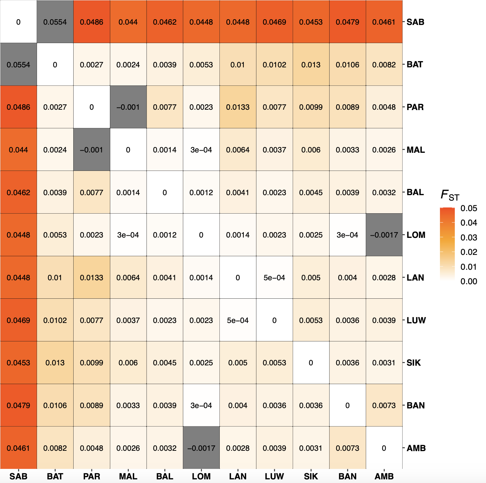
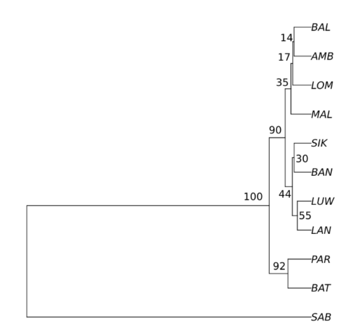

# Highlighting sea_urchin **Diadema setosum** population structure

Population structure in sea urchin was first investigated following these steps:
* 1 - Sampling design
* 2 - Estimating genetic differentiation among populations
* 3 - Testing for Isolation by distance patterns

First a sampling map showing all sampling locations in relation to oceanic currents was created using the R script.
`r, echo=FALSE,
script-sampling-map.R
`

## 1 - Sampling design

A total of 11 sampling locations were sampled.
About 10 individuals were genotyped per sampling locations, for a total of 87 individuals kept after filtering.

{weight=60%}

## 2 - Estimating genetic differentiation among populations
We use the function `genet.dist` available in [hierfstat](https://rdrr.io/cran/hierfstat/man/genet.dist.html) R package.
This function estimate the pairwise FST values according to Weir & Cockerham (1984).
FST measures the amount of genetic differentiation among populations (and simultaneously the extent to which individuals within populations are similar to one another).
A total of 55 pairwise comparisons (i.e. (n*(n-1))/2; 11*10)/2) ranges from 0 to 0.055.

{weight=60%}

A total of 48 P-values were non significant.
The P-values were tighly associated to the boostrap tree obtained on FST.

{weight=60%}

|Variation	 %var  |F-stat|F-value|c.i.2.5% |c.i.97.5%|	P-value	   | 
|------------------|------|-------|---------|---------|------------|
|Within individuals|0.669 |	Fit	  |0.331	  |0.327	  |0.334	--	 |
|Within location	 |0.310 |	Fis	  |0.317	  |0.313	  |0.320	0.001|
|Among location	   |0.003 |	Fsc	  |0.004	  |0.003	  |0.005	0.001|	
|Among regions	   |0.017 |	Fct	  |0.017	  |0.016	  |0.018	0.001|	

## 3 - Testing for Isolation by distance patterns

Isolation by distance was investigated in two ways: considering either Euclidean and in-water geographic distances.
Significance in the isolation by distance relationship can be tested statistically using a Mantel test. 
This test assesses whether the pairwise genetic distance matrix is correlated with the pairwise geographic distance matrix.
Three Mantel tests were performed, accordingly to AMOVA results (3 populations present):
* all samples : IBD significant when using in-water distances 
* without SAB : IBD significant 
* without SAB, BAT, PAR : IBD non significant

{weight=60%}